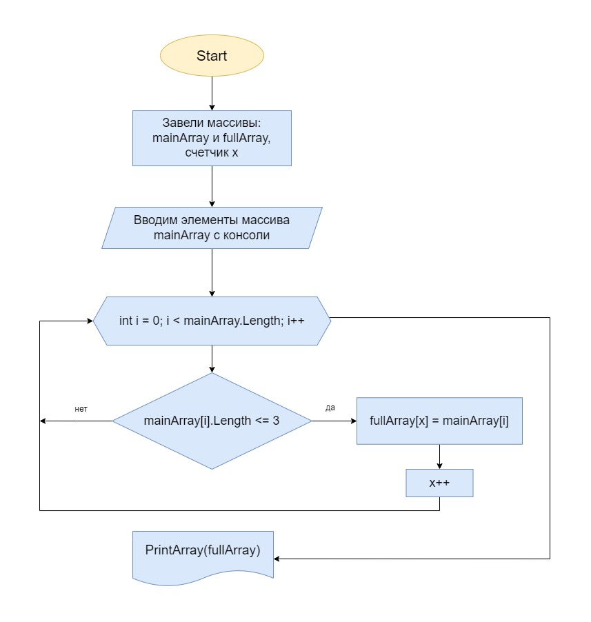

## Контрольная работа

Задача контрольной работы заключается в проверке знаний и навыков, полученных по итогу прохождения первого блока обучения на программе Разработчик. 

На этом этапе можно убедиться, что базовое знакомство с IT прошло успешно.

### Алгоритм выполнения контрольной 

1. Создать репозиторий на GitHub
2. Нарисовать блок-схему алгоритма 
3. Снабдить репозиторий оформленным текстовым описанием решения (файл README.md)
4. Написать программу, решающую поставленную задачу
5. Использовать контроль версий в работе над этим небольшим проектом.

### Задача 

Задача: Написать программу, которая из имеющегося массива строк формирует новый массив из строк, длина которых меньше, либо равна 3 символам. Первоначальный массив можно ввести с клавиатуры, либо задать на старте выполнения алгоритма. При решении не рекомендуется пользоваться коллекциями, лучше обойтись исключительно массивами.

Примеры:
[“Hello”, “2”, “world”, “:-)”] → [“2”, “:-)”]
[“1234”, “1567”, “-2”, “computer science”] → [“-2”]
[“Russia”, “Denmark”, “Kazan”] → []

### Блок-схема

